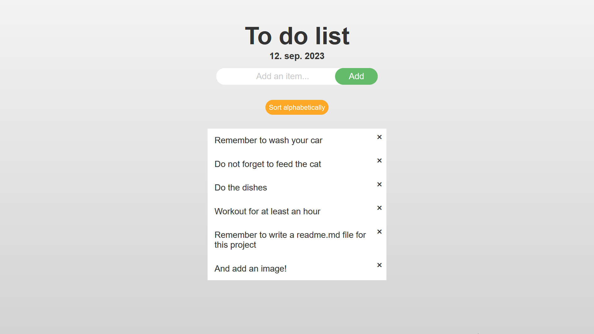

# To do list

For this project we were tasked with using what we learned this week to create a todo list using javascript.
This was a entertaning and fun project to work with as well as being challenging.

I made my todo list simple in it's design, it's a todo list so it doesn't need to be fancy. I added the ability for the user to submit their task by either clicking the submit button or by pressing their "enter" keyboard key.

Each task submited generates it as a list item in an unsorted list. And along with it being a list item a span icon is generted and placed at the end of the list. This span is used as a option to remove the task.

I added a sort button as well so that the users can sort their tasks alphabetically. I considered adding timestamps for the tasks and the ability to sort them by the time published, but that would clutter the simple design I wanted to go for.

